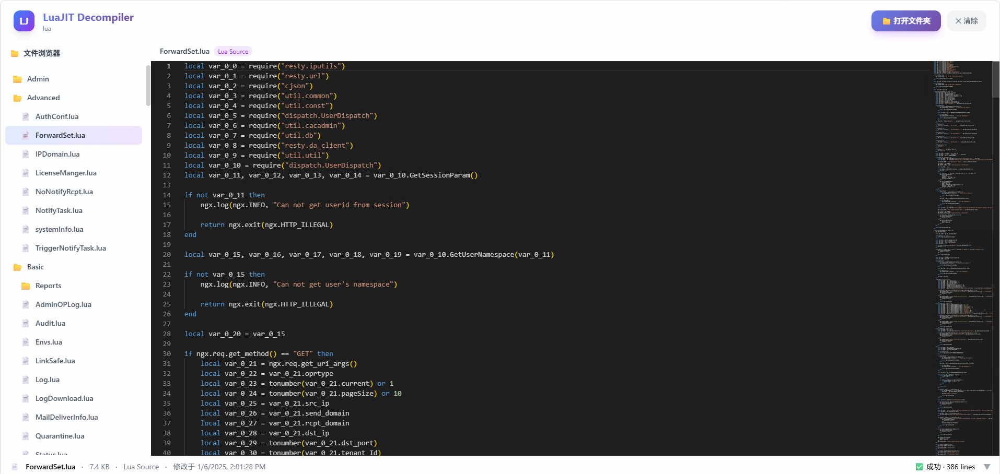

# LuaJIT Decompiler Online

A powerful, browser-based LuaJIT bytecode decompiler that runs entirely client-side using WebAssembly. No server required - decompile your `.luac` files directly in your browser with a modern, intuitive interface.



## Features

- **100% Client-Side**: All processing happens in your browser using WebAssembly (Wasmer). No data is sent to any server.
- **Folder Browser**: Open local folders and browse your project structure with a tree view.
- **Drag & Drop Support**: Simply drag and drop folders or files onto the interface.
- **File Type Detection**: Automatically detects Lua bytecode vs Lua source files.
- **Syntax Highlighting**: Professional code viewing with Monaco Editor and Lua syntax highlighting.
- **Media Preview**: Built-in preview support for images, audio, and video files.
- **Status Bar**: Real-time file information including size, encoding, line count, and decompile status.
- **Modern UI**: Beautiful glass-morphism design with gradient accents, built with Vue 3, Tailwind CSS, and TypeScript.

## How It Works

The decompiler uses [LuaJIT](https://luajit.org/) running on [Wasmer](https://wasmer.io/) WebAssembly runtime:

1. LuaJIT bytecode files (`.luac`) are loaded into a virtual filesystem via Wasmer's WASIX capabilities
2. LuaJIT is invoked in bytecode dump mode to convert `.luac` back to Lua source
3. The decompiled Lua source is displayed with syntax highlighting

## Tech Stack

- **Frontend**: Vue 3, TypeScript, Tailwind CSS
- **Code Editor**: Monaco Editor
- **WebAssembly Runtime**: Wasmer SDK
- **Build Tool**: Vite

## Getting Started

### Prerequisites

- Node.js 18+ and npm

### Installation

```bash
npm install
```

### Development

```bash
npm run dev
```

Open http://localhost:5173 in your browser.

### Build

```bash
npm run build
```

The built files will be in the `dist/` directory.

### GitHub Pages Build

For deployment to GitHub Pages subdirectory:

```bash
npm run build:github
```

## Usage

1. **Open a Folder**: Click the "Open Folder" button to select a local directory containing your Lua files.
2. **Browse Files**: Navigate through the folder tree on the left panel.
3. **View Decompiled Code**: Click on any `.luac` file to view its decompiled Lua source.
4. **File Preview**: Non-Lua files are previewed directly in the browser (images, audio, video).

## File Types

The decompiler handles:

| File Type | Description | Action |
|-----------|-------------|--------|
| `.luac` | LuaJIT bytecode | Attempt to decompile to Lua source |
| `.lua` | Lua source code | Display directly |
| Images | PNG, JPG, GIF, WebP, SVG | Preview in browser |
| Audio | MP3, WAV, OGG | Audio player |
| Video | MP4, WebM | Video player |
| Other | Any other file type | Hex view with raw data |

## Privacy

All file processing happens entirely in your browser. **No files are uploaded to any server.** Your bytecode and source code never leave your machine.

## Browser Compatibility

- Chrome 89+
- Firefox 79+
- Safari 15.2+
- Edge 89+

Requires support for:
- WebAssembly
- WebAssembly SIMD
- File System Access API (for folder browsing)

## License

MIT License

Copyright (c) 2026 liudonghua123

## Related Projects

- [LuaJIT](https://luajit.org/) - The underlying Lua Just-In-Time Compiler
- [Wasmer](https://wasmer.io/) - The WebAssembly runtime used for running LuaJIT in the browser